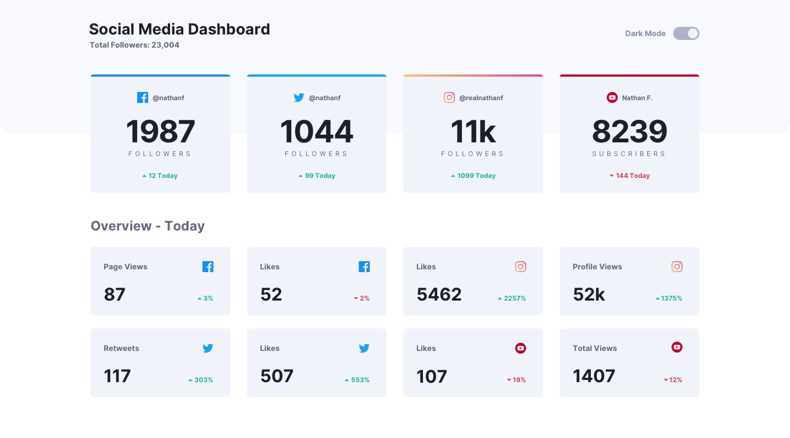

# Frontend Mentor - Social media dashboard with theme switcher

This is a solution to the [Social media dashboard with theme switcher challenge on Frontend Mentor](https://www.frontendmentor.io/challenges/social-media-dashboard-with-theme-switcher-6oY8ozp_H). Frontend Mentor challenges help you improve your coding skills by building realistic projects. 

## Table of contents

- [Overview](#overview)
  - [The challenge](#the-challenge)
  - [Screenshot](#screenshot)
  - [Links](#links)
- [My process](#my-process)
  - [Built with](#built-with)
  - [What I learned](#what-i-learned)
  - [Continued development](#continued-development)
  - [Useful resources](#useful-resources)
- [Author](#author)
- [Acknowledgments](#acknowledgments)


## Overview

### The challenge

Users should be able to:

- View the optimal layout for the site depending on their device's screen size
- See hover states for all interactive elements on the page
- Toggle color theme to their preference

### Screenshot





### Links

- Solution URL: [GitHub](https://github.com/zuzexx/FM_socialMediaDashboardWithThemeSwitcher)
- Live Site URL: [Add live site URL here](https://your-live-site-url.com)

## My process

I looked at the desktop and mobile layout and divided the site into a few different containers (header, top container and bottom container). After that I have written some basic code for the theme switcher. At first I was only concerned with it working. I was planning on tweaking it later. After that I have written all of the basic styling for containers. First the background and basic positioning for mobile layout, after that I stylied text and images. I styled every component until I was happy with the result..

### Built with

- Semantic HTML5 markup
- CSS custom properties
- Flexbox
- CSS Grid
- Mobile-first workflow
- [Theme toggle](https://github.com/saadeghi/theme-change) - tiny JS script to handle CSS themes
- [Svelte theme Switcher](https://www.npmjs.com/package/svelte-theme-switcher) - A happy little svelte theme switcher to brighten or maybe darken your day 🌞.
- [Svelte](https://svelte.dev/) - JS framework


### What I learned

I learned how to toggle tark mode in Svelte. Who would have thought that it takes just a few lines of code. I also learned how to do a linear-gradient border.

```html
<h1>Some HTML code I'm proud of</h1>
```
```css
.proud-of-this-css {
  /*---This is how to do a gradient border---*/
  .ini{
    background: 
    linear-gradient(hsl(37, 97%, 70%), hsl(329, 70%, 58%)) padding-box,
    linear-gradient(hsl(37, 97%, 70%), hsl(329, 70%, 58%)) border-box;
  border-radius: 10px;
  border-top: 3px solid transparent;
  width:326px;
}
}
```
```js
function toggle() {
    window.document.body.classList.toggle('dark-mode')
}
}
```


### Continued development

Learn more about Svelte. I want to tweak this projest a bit more in the future.

### Useful resources

- [Theme toggle](https://www.w3schools.com/howto/howto_css_switch.asp) - reference on how to do toggles
- [Theme switcher](https://www.npmjs.com/package/svelte-theme-switcher) - I used this to help me with the theme switching
- [stackoverflow](https://stackoverflow.com/questions/57239504/how-to-set-global-style-on-event-in-svelte) - helped with theme switching
- [CSS gradient borders](https://codyhouse.co/nuggets/css-gradient-borders) - how to do gradient borders
- [Robin Cussol chalenge sollution](https://www.frontendmentor.io/solutions/social-media-dashboard-with-theme-switcher-svelte-tailwindcss-Px8_2pXWU) - while studying this solution I finally understood how everything works together when it comes to switching theme in Svelte


## Author

- Website - [GitHub](https://github.com/zuzexx)
- Frontend Mentor - [@zuzexx](https://www.frontendmentor.io/profile/zuzexx)
- Linkedin - [Linkedin](https://www.linkedin.com/in/tjasa-zilavec/)


## Acknowledgments

Thank you to everybody on Frontend Mentor for taking their time to look at my code and make suggestions.
