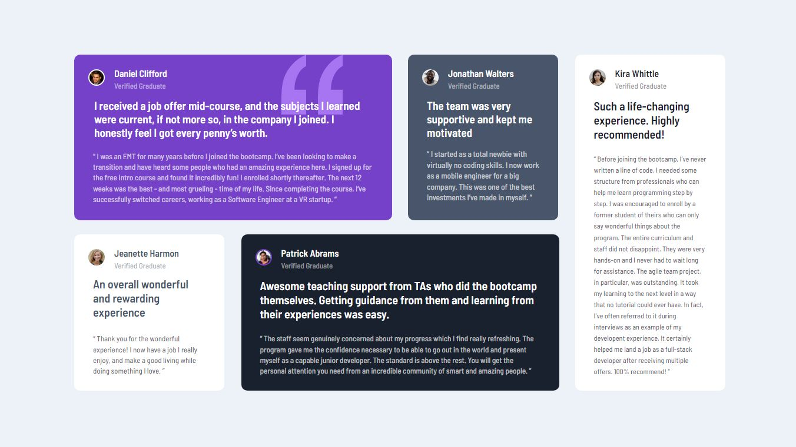

# Frontend Mentor - Testimonials grid section solution

This is a solution to the [Testimonials grid section challenge on Frontend Mentor](https://www.frontendmentor.io/challenges/testimonials-grid-section-Nnw6J7Un7). Frontend Mentor challenges help you improve your coding skills by building realistic projects. 

## Table of contents

- [Overview](#overview)
  - [The challenge](#the-challenge)
  - [Screenshot](#screenshot)
  - [Links](#links)
- [My process](#my-process)
  - [Built with](#built-with)
  - [What I learned](#what-i-learned)
  - [Continued development](#continued-development)
  - [Useful resources](#useful-resources)
- [Author](#author)
- [Acknowledgments](#acknowledgments)

## Overview

### The challenge

Users should be able to:

- View the optimal layout for the site depending on their device's screen size

### Screenshot

### Links

- Solution URL: [GitHub](https://github.com/zuzexx/FM_TestimonialsGridSection)
- Live Site URL: [Live Site](https://fm-testimonials-grid-section-swart.vercel.app/)

## My process
I divided the site into five different containers. One for each testimonial. I have written HTML for each of the containers first. Added global CSS styles for font, headers and images. After that I stiled each container individually with CSS. I have positioned the items on the page using grid.
### Built with

- Semantic HTML5 markup
- CSS custom properties
- Flexbox
- CSS Grid
- Mobile-first workflow
- Vanilla JS
- [Svelte](https://svelte.dev/) - JS framework

### What I learned

I learned basics of Svelte. 

### Continued development

I want to focus more on learning Javascript and honing my Svelte skills.

### Useful resources

- [Svelte tutorial](https://www.youtube.com/watch?v=ujbE0mzX-CU&ab_channel=freeCodeCamp.org) - A tutorial I have been followinh when learning Svelte
- [Svelte Documentation](https://svelte.dev/docs#before-we-begin) 

## Author

- Website - [GitHub](https://github.com/zuzexx)
- Frontend Mentor - [@zuzexx](https://www.frontendmentor.io/profile/zuzexx)
- Linkedin - [Linkedin](https://www.linkedin.com/in/tjasa-zilavec/)

## Acknowledgments

Thank you to everybody on Frontend Mentor for taking their time to look at my code and make suggestions.
